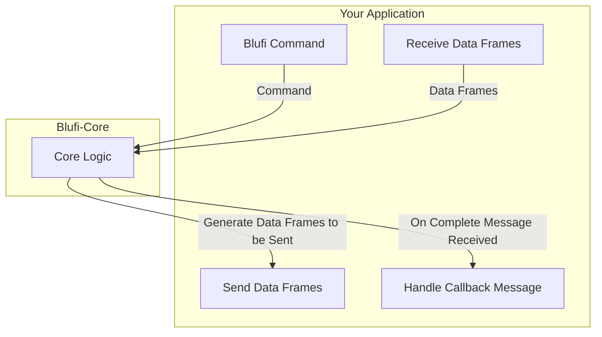

# Blufi-Core

[](LICENSE)
[](https://github.com/Gdszzy/blufi-core/releases)

A core logic library designed to simplify the use of Espressif's [BluFi](https://docs.espressif.com/projects/esp-idf/en/stable/esp32/api-guides/ble/blufi.html) provisioning protocol. It handles the low-level frame encoding and decoding, allowing you to focus on your application's business logic and the connection with the ESP32 device.

## ✨ Features

- **Cross-Platform**: Built with a C++ core, enabling compilation for multiple platforms.
  - ✅ **Web**: WebAssembly + JavaScript
  - ✅ **Android**: JNI
- **Simplified API**: Encapsulates complex frame processing logic, providing an easy-to-use interface for generating and parsing BluFi messages.
- **Lightweight**: The core library does not include any Bluetooth connection logic, making it easy to integrate into any existing project.

## 🏗️ Architecture

`blufi-core` acts as a bridge between your application layer and Bluetooth communication, responsible for encoding your commands into BluFi frames and decoding incoming frames from the device into complete messages.



- **Your Application**: Responsible for handling the BLE connection, as well as sending and receiving data packets to and from the ESP32 device.
- **Blufi-Core**: Manages the encoding of application commands (like `connectWifi`) into multiple data frames. It also decodes incoming data frames from the BLE connection into a single, complete message, which is then delivered to your application via a callback.

## 🚀 Getting Started

### Web (WebAssembly)

1.  Download the latest `blufi.js` and `blufi.wasm` files from the [Releases](https://github.com/Gdszzy/blufi-core/releases) page.
2.  Place them in your web project's assets or public directory.

**Example Usage:**

```javascript
import blufiLoader from './blufi.js'
import blufiWasmUrl from './blufi.wasm?url'

// Asynchronously load the WASM module
const blufiModule = await blufiLoader({
  // Emscripten supports multiple ways to load the wasm file
  locateFile: () => blufiWasmUrl
})

// Assume you have already scanned for and connected to the BLE device,
// and have obtained the read/write characteristics.
// await connectBLEDevice();
const blufiWriteChar = getBlufiWriteChar() // Your characteristic for writing
const blufiNotifyChar = getBlufiNotifyChar() // Your characteristic for notifications

// Instantiate BlufiCore
const core = new blufiModule.BlufiCore(
  128, // MTU (Maximum Transmission Unit)
  (type, subType, buffer) => {
    // This callback is invoked when the core parses a complete message
    console.log(`Received message: type=${type}, subType=${subType}`)
    if (type == blufiModule.MsgType.VALUE && subType == blufiModule.MsgSubType.NEG) {
      // Upon receiving a security negotiation message, you must send the
      // data in `buffer` back to the ESP32 via the write characteristic.
      // NOTE: Send this response frame only after you have sent all negotiation request frames.
      // See the "Important: Key Negotiation Flow" section below for details.
      const negotiationResponse = new Uint8Array(buffer)
      // await blufiWriteChar.writeValue(negotiationResponse);
    }
    // Handle other message types here...
  }
)

// Listen for notifications from the BLE characteristic
blufiNotifyChar.oncharacteristicvaluechanged = (event) => {
  const receivedData = new Uint8Array(event.currentTarget.value.buffer)
  // Feed all incoming data from the BLE device into the core for processing
  core.onReceiveData(receivedData)
}
await blufiNotifyChar.startNotifications()

// ---- Now you can use the core to generate data packets to send ----

// 1. Generate key negotiation message frames.
// This returns an array of frames that need to be sent sequentially.
const negotiateKeyFrames = core.negotiateKey()

// 2. Generate frames for other commands
// const scanWifiFrames = core.scanWifi();
// const connectWifiFrames = core.connectWifi("Your_SSID", "Your_Password");
// const customDataFrames = core.custom(new Uint8Array([0xde, 0xad, 0xbe, 0xef]));

// 3. Send the generated frames over BLE
for (const frame of negotiateKeyFrames) {
  await blufiWriteChar.writeValue(frame)
}
```

### Android (JNI)

1.  Download the latest `libblufi.so` file from the [Releases](https://github.com/Gdszzy/blufi-core/releases) page.
2.  Place it into your Android project's `src/main/jniLibs/arm64-v8a` directory.
3.  Add the [Core.kt](https://github.com/Gdszzy/blufi-core/blob/simplify/Core.kt) wrapper class to your project.

**Example Usage:**

```kotlin
// Assume you have already connected to the device and discovered services
// val blufiWriteChar = getGattWriteCharacteristic()
// val blufiNotifyChar = getGattNotifyCharacteristic()

// 1. Implement the callback interface
val messageCallback = object : Core.OnMessageCallback {
    override fun onMessage(type: Byte, subType: Byte, buffer: ByteBuffer) {
        Log.d("Blufi", "Received message: type=$type, subType=$subType")
        if (type == Core.TYPE_VALUE && subType == Core.SUBTYPE_NEG) {
            // Received the security negotiation response, prepare to send it back
            val responseData = ByteArray(buffer.remaining())
            buffer.get(responseData)
            // writeToBle(blufiWriteChar, responseData)
        }
    }
}

// 2. Initialize the Core
val mtu = 128 // Set your MTU
val blufiCore = Core(mtu, messageCallback)

// 3. Enable and listen for BLE notifications
// gatt.setCharacteristicNotification(blufiNotifyChar, true)
// onCharacteristicChanged(characteristic: BluetoothGattCharacteristic) {
//     if (characteristic.uuid == BLUFI_NOTIFY_UUID) {
//         blufiCore.onReceiveData(characteristic.value)
//     }
// }

// 4. Use the core to generate data and send it
val negotiateFrames = blufiCore.negotiateKey()
for (frame in negotiateFrames) {
    // writeToBle(blufiWriteChar, frame)
}

// val connectFrames = blufiCore.connectWifi("Your_SSID", "Your_Password")
// for (frame in connectFrames) {
//     // writeToBle(blufiWriteChar, frame)
// }
```

## ⚠️ Important: Key Negotiation Flow

The key negotiation process is asynchronous and requires a specific order of operations.

When you call `core.negotiateKey()`, it generates multiple data frames (e.g., 5 frames). You must send all of these frames sequentially to the ESP32.

```
  Client             ESP32
    |                  |
    | --- frame 1 ---> |
    | --- frame 2 ---> |
    | --- frame 3 ---> |
    |                  |
    | <--- response ---|  (The ESP32 may respond before you have finished sending)
    |                  |
    | --- frame 4 ---> |
    | --- frame 5 ---> |
    |                  |
```

During this process, you will receive a response message of type `SUBTYPE_NEG` via your `onMessageCallback`.

**CRITICAL**: You **must** wait until you have sent all frames generated by `negotiateKey()` (5 frames in this example) **before** you send the response data you received in the `onMessageCallback`.

The correct final sequence should be:

```
  Client                                     ESP32
    |                                          |
    | --- All frames from negotiateKey() --->  |
    |                                          |
    | --- Send the SUBTYPE_NEG response --->   |
    |                                          |
```

## 🤝 Contributing

Contributions are welcome\! If you have ideas, suggestions, or bug reports, please feel free to open an [Issue](https://www.google.com/search?q=https://github.com/Gdszzy/blufi-core/issues) or submit a [Pull Request](https://www.google.com/search?q=https://github.com/Gdszzy/blufi-core/pulls).

## 📄 License

This project is licensed under the [MIT License](https://www.google.com/search?q=LICENSE).
