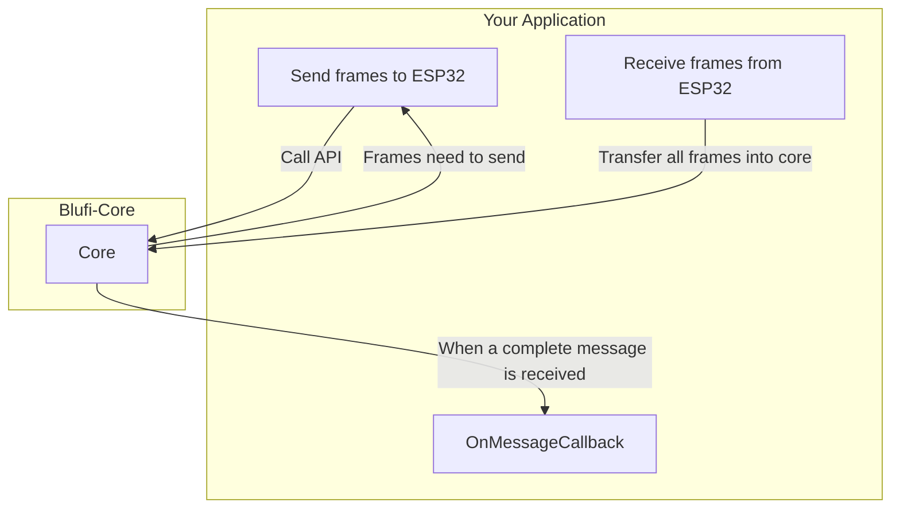

## blufi-core

This library is mainly to simplify the use of blufi.

The core written by C++ and can be compiled to WebAssembly and JNI library.

Not it support:

- web (WebAssembly+JavaScript)
- Android (JNI)

### Architecure



- Your application: Process connections and the transmissions with BLE. Sending and receiving frames.
- Blufi-Core: Encoding message into frames and decoding frames into message.

### Usage (WebAssembly+JavaScript)

Download **blufi.js** and **blufi.wasm** from [releases](https://github.com/Gdszzy/blufi-core/releases)

```js
import blufiLoader from './blufi.js'
import blufiWasmUrl from './blufi.wasm?url'

// Loading wasm module
const blufiModule = (blufiModule = await blufiLoader({
  // Using locateFile or any other way supported in Emscripten
  locateFile: () => blufiWasmUrl
}))

// Scanning and connect to your BLE device
connectBLEDevice()
const blufiWriteChar = getBlufiWriteChar()
const blufiNotifyChar = getBlufiReadChar()

const core = new blufiModule.BlufiCore(
  // mtu
  128,
  // onBlufiMessageCallback
  (type, subType, buffer) => {
    if (type == blufiModule.MsgType.VALUE) {
      if (subType == blufiModule.MsgSubType.NEG) {
        // Negotiate message
        // You have to send the [buffer] to [blufiWriteChar]
      }
      // Other message process
    }
  }
)

// Enable notification
blufiNotifyChar.oncharacteristicvaluechanged = (evt) => {
  const buf = new Uint8Array(evt.currentTarget.value.buffer)
  // Send all data received into core
  // When a complete message received. onBlufiMessageCallback will be called
  core.onReceiveData(buf)
}
blufiNotifyChar.startNotifications()

// Initialization completed. Start to use core
// All of these functions just help you to create the message you need send.
const negotiateKeyMessage: Array<Uint8Array> = core.negotiateKey()
// core.scanWifi()
// core.connectWifi(ssid, password)
// core.custom(new Uint8Array([0xff, 0xaa]))

// Then sent them by yourself.
for (const data of negotiateKeyMessage) {
  await blufiWriteChar.write(data)
}
```

### Usage (JNI)

Download **libblufi.so** from [releases](https://github.com/Gdszzy/blufi-core/releases)

Copy this class into your project

```kotlin
package com.gdszzy.blufi

import java.nio.ByteBuffer
import java.nio.ByteOrder

class Core(mtu:Int,callback: OnMessageCallback) {

    private val ptr: Long=newCore(mtu,callback as Object)

    private fun parseFlattenBuffer(buffer: ByteBuffer):List<ByteArray>{
        buffer.order(ByteOrder.LITTLE_ENDIAN)
        val list= ArrayList<ByteArray>()
        while(buffer.remaining()>0){
            val len=buffer.getInt()
            val byteArray = ByteArray(len)
            buffer.get(byteArray)
            list.add(byteArray)
        }
        return list
    }

    fun onReceiveData(buffer: ByteArray):Byte{
        return onReceiveData(ptr,buffer)
    }

    fun custom(buffer: ByteArray):List<ByteArray>{
        return parseFlattenBuffer(custom(ptr,buffer))
    }

    fun scanWifi():List<ByteArray>{
        return parseFlattenBuffer(scanWifi(ptr))
    }

    fun connectWifi(ssid: String,pass: String): List<ByteArray>{
        return parseFlattenBuffer(connectWifi(ptr,ssid,pass))
    }

    fun negotiateKey():List<ByteArray>{
        return parseFlattenBuffer(negotiateKey(ptr))
    }

    protected fun finalize() {
        freeCore(ptr)
    }

    private external fun newCore(mtu:Int,callback: Object): Long
    private external fun freeCore(ptr:Long)
    private external fun onReceiveData(ptr:Long,buffer: ByteArray): Byte
    private external fun custom(ptr:Long,buffer: ByteArray): ByteBuffer
    private external fun scanWifi(ptr:Long): ByteBuffer
    private external fun connectWifi(ptr:Long,ssid:String,pass:String): ByteBuffer
    private external fun negotiateKey(ptr:Long): ByteBuffer

    companion object{
        init {
            System.loadLibrary("blufi")
        }
        const val TYPE_CONTROL_VALUE:Byte=0x00
        const val TYPE_VALUE:Byte=0x01
        // value
        const val SUBTYPE_NEG:Byte = 0x00
        const val SUBTYPE_SET_SEC_MODE:Byte = 0x01
        const val SUBTYPE_SET_SSID:Byte = 0x02
        const val SUBTYPE_SET_PWD:Byte = 0x03
        const val SUBTYPE_CUSTOM_DATA:Byte = 0x13
        const val SUBTYPE_WIFI_LIST_NEG:Byte = 0x11
        const val SUBTYPE_WIFI_STATUS:Byte = 0x0F
        const val SUBTYPE_ERROR:Byte = 0x12
        // control value
        const val SUBTYPE_END:Byte = 0x03
        const val SUBTYPE_WIFI_NEG:Byte = 0x09
    }

    interface OnMessageCallback{
        // When core received a complete message. This callback will be invoked
        // When SUBTYPE_NEG message received. Send the buffer to ESP32.
        fun onMessage(type:Byte,subType:Byte,buffer: ByteBuffer)
    }
}
```

### Notice

About negotiate key. For example you have 5 frames to send.

device --- frame1 --> ESP32
device --- frame2 --> ESP32
device --- frame3 --> ESP32

// ESP32 will respond before sending is completed
device <-- frame1 --- ESP32

device --- frame4 --> ESP32
device --- frame5 --> ESP32

// Make sure the response frame from SUBTYPE_NEG message callback is sent after 5 frames of the negotiate key.
device --- frame6 --> ESP32
